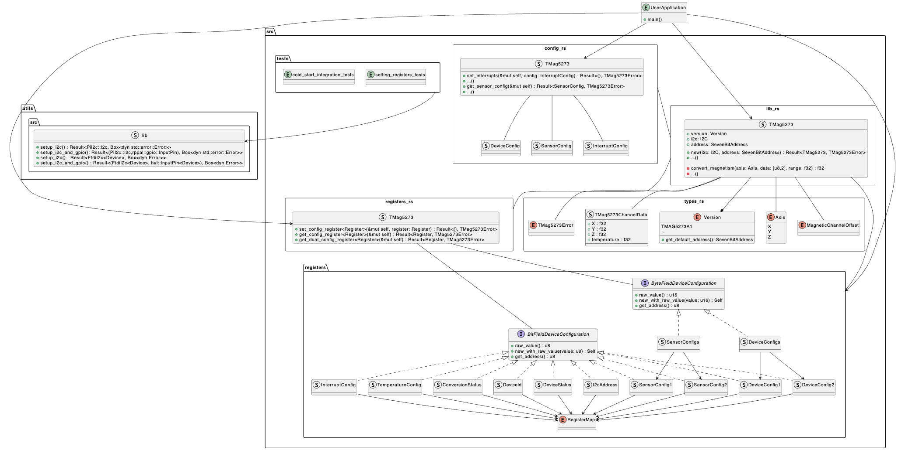

# TMAG5273 Rust Driver

[](https://github.com/dysonltd/tmag5273/actions/workflows/mega-linter.yaml)
[](https://github.com/dysonltd/tmag5273/actions/workflows/continuous_build.yaml)
[](https://github.com/dysonltd/tmag5273/actions/workflows/continuous_integration.yaml)

## Summary

This is a platform agnostic Rust Driver for the TMAG52732 3 Axis I2C Hall effect Sensor by Texas Instruments. The driver is based on the [embedded-hal](https://github.com/rust-embedded/embedded-hal) traits. For more information it is recommended to look at the docs using `cargo doc`

## The Device

An extract taken from the [Texas Instruments Datasheet](./docs/tmag5273.pdf):
>The TMAG5273 is a low-power linear 3D Hall-effect sensor designed for a wide range of industrial and personal electronics applications. This device integrates three independent Hall-effect sensors in the X, Y, and Z axes. A precision analog signal-chain along with an integrated 12-bit ADC digitizes the measured analog magnetic field values. The I2C interface, while supporting multiple operating VCC ranges, ensures seamless data communication with low-voltage microcontrollers. The device has an integrated temperature sensor available for multiple system functions, such as thermal budget check or temperature compensation calculation for a given magnetic field.The TMAG5273 can be configured through the I2C interface to enable any combination of magnetic axes and temperature measurements. Additionally, the device can be configured to various power options (including wake-up and sleep mode) allowing designers to optimize system power consumption based on their system-level needs. Multiple sensor conversion schemes and I2C read frames help optimize throughput and accuracy. A dedicated INT pin can act as a system interrupt during low power wake-up and sleep mode, and can also be used by a microcontroller to trigger a new sensor conversion.An integrated angle calculation engine (CORDIC) provides full 360° angular position information for both on-axis and off-axis angle measurement topologies. The angle calculation is performed using two user-selected magnetic axes. The device features magnetic gain and offset correction to mitigate the
impact of system mechanical error sources.The TMAG5273 is offered in four different factory-programmed I2C addresses. The device also supports additional I2C addresses through the modification
of a user-configurable I2C address register. Each orderable part can be configured to select one of two magnetic field ranges that suits the magnet strength and component placement during system calibration.

## Examples

Examples on how to use the driver across multiple platforms can be found [here](./examples/README.md)

## Architecture Diagrams

The rough architecture of the files and directories of the project can be seen in the following plantUML diagram.



As an application developer, you will spend most of your time working with the TMAG5273 struct outlined in [lib.rs](./src/lib.rs). The device can initialised by the `init_default` method and configuration can be done using the methods outlined in [config.rs](./src/config.rs). However for fine grained control of the device you can set and configure the raw registers outlined in the
folder [registers](./src/registers/). More information around the code can be found using `cargo doc`.

## Helper Utilities

In this repository we also have an internal crate called [utils](./utils/) which contains some simple rust code for using the library on either Raspberry Pi or a Desktop Linux/Mac Machine. For more information, please look at the following [README](./utils/README.md).

## Continuous Integration Testing

Within this repo we also run a Continuous Integration hardware in the loop test bench. The architecture of this is shown below and more information can be found [here](./.github/test_bench/README.md).


On top of that we also compile our examples, core library and utils package on multiple platforms in both std and no-std variations. For more on this see [Continuous Build](./.github/workflows/continuous_build.yaml).

## Running your Linter Locally

This project uses [MegaLinter](https://github.com/oxsecurity/megalinter) which provides linters for various different file formats and languages. When a Pull request to main is done, the linters will run and ensure the codebase is in good standing. It is recommended that you run the linter locally beforehand as it can sometimes autofix common mistakes.

```bash
npx mega-linter-runner
```

You will need to have docker and Node installed to use this, more information can be found on their [repo](https://github.com/oxsecurity/megalinter)

### Issues with rust fmt

Currently at the time of this commit `rust fmt` is not supported as part of MegaLinter, thus to ensure it is correctly formatted we have added an extra build stage which can be seen [here](./.github/workflows/mega-linter.yaml). You can run this locally using

```bash
cargo fmt --all
```

## Useful Links

- [Embedded Hal](https://docs.rs/embedded-hal/latest/embedded_hal/)
- [TMAG5273 Breakout Board](https://www.sparkfun.com/products/23880)
- [FT232H Breakout Board](https://www.adafruit.com/product/2264)
